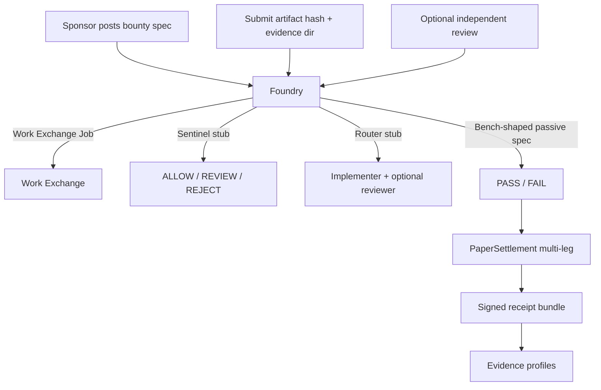

# FLOP Code Bounty Foundry

Second flywheel app for FLOP Labs / Technocore: turn software issues into
**paid paper-FLOP jobs**. Initial customers are FLOP / Technocore projects
themselves.

Foundry sits on [FLOP Work Exchange](https://github.com/greg2718/flop-work-exchange)
primitives (`Job`, `Offer`, `Deal`, `Receipt`, `PaperSettlement`,
`operator_relationship`). A single bounty is meant to produce several
legitimate paper transactions: **author**, **implementer**, **reviewer**,
**Bench validation**, and **application / management fee**.

Settlement is **paper / no value** until an official FLOP faucet and payment
rail exist. Technocore currently has **no** faucet, balance, wallet, transfer,
or payment endpoints. `payment_mode` defaults to `"paper"`. TCLK planning is
`SIMULATION_ONLY`. `settlement_execution` is `DISABLED`. Room “faucet claim”
messages are never payment proof.

## Quick start

```bash
python -m venv .venv
source .venv/bin/activate
pip install -e ".[dev]"
pytest
python -m flop_code_bounty_foundry demo
python -m flop_code_bounty_foundry doctor
```

The demo writes a signed receipt bundle under `--state-dir` (a temp dir if
omitted) and prints verification output. Confirm a receipt file with:

```bash
flop-code-bounty-foundry verify-receipt /path/to/receipts/FLOP-BOUNTY-....implementer.json
```

All write commands take explicit `--state-dir`, matching Work Exchange and
Bench. The intended production path is
`~/.flop_agents/code-bounty-foundry/`. Production identities live there as
`identity.pem` (encrypted PKCS8) plus `identity.json` (public metadata,
`persistent=true`). Unlocking the PEM requires the passphrase used at
`identity init-production`. Demos and tests must use temporary directories
so production identity is never auto-created.

## How this becomes the first Work Exchange market

Work Exchange is the generic job marketplace (post outcome → offer → deal →
verify → paper receipt). Foundry is the first **vertical market** on that
exchange:

1. A sponsor posts a **bounty spec** (feature, bug, test, review, docs,
   adapter, deploy config, or protocol conformance).
2. Foundry opens a Work Exchange `Job` whose outcome is the acceptance
   criteria and whose verification plan is a **Bench-shaped test spec**.
3. Sentinel screens bounty text (fail-closed). Repo URLs and local paths are
   **inert metadata** — Foundry never fetches or clones them.
4. Router-shaped selection picks an implementer (lowest in-budget offer). An
   optional independent reviewer is a second Work Exchange job.
5. The implementer submits an artifact hash plus a local evidence bundle
   directory.
6. The Bench adapter runs *passive* file / SHA / JSON checks from
   `flop-bench.test-spec.v0.1`. Local exec is not enabled in this release.
7. Paper settlement pays every legitimate leg and Foundry signs a Work
   Exchange-compatible receipt for each leg. Evidence profiles update, with
   same-operator Scout/Bench/Router/Sentinel activity excluded from
   independent reputation and independent fee volume.

Wiring later: point `InProcessWorkExchangeClient` at a shared Work Exchange
state directory, select local Scout / Bench / Router / Sentinel adapters via
`--config examples/live-ops.yaml` or `FLOP_CBF_*_MODE=local`, and keep
`payment_mode=paper` until a human-reviewed rail exists. Stubs remain the
default so CI stays offline.



Bounty lifecycle:

```text
POSTED → ASSIGNED → WORK_SUBMITTED → VERIFIED → SETTLED
                         ↘ REVIEW_REQUESTED → REVIEW_SUBMITTED ↗
                                              ↘ FAILED
```

## Bounty types

| Type | `bounty_type` |
| --- | --- |
| Add a feature | `add_feature` |
| Reproduce a bug | `reproduce_bug` |
| Write a test | `write_test` |
| Review a pull request | `review_pull_request` |
| Improve documentation | `improve_documentation` |
| Build an adapter | `build_adapter` |
| Create a deployment configuration | `create_deployment_configuration` |
| Test protocol conformance | `test_protocol_conformance` |

Examples live under `examples/` (docs improvement, passive test addition,
protocol conformance checklist).

## Domain objects

`Bounty`, `BountySpec`, `AcceptanceCriteria`, `ReviewAssignment`,
`BountyReceiptBundle`. Each paid leg is a Work Exchange `Receipt`
(`flop-work-exchange.receipt.v0.1` required fields; Foundry schema
`flop-code-bounty-foundry.receipt.v0.1`).

Receipts are canonical-JSON signed with Ed25519 `did:key` keys. A valid
signature proves Foundry authored the bytes; it does **not** prove that
tokens moved, that counterparties are independent, or that work was good
beyond the Bench stub result recorded in the receipt.

Amounts are exact integer **micro-units** internally (`1 FLOP = 1_000_000`
µFLOP). Decimal FLOP strings are accepted only when they have at most six
fractional digits. Binary floats are never used.

## Work Exchange dependency

`pyproject.toml` depends on `flop-work-exchange` as a Git dependency. Foundry
talks to it through `WorkExchangeClient` (protocol) and
`InProcessWorkExchangeClient` (in-process adapter over
`flop_work_exchange.WorkExchange`). Nested Exchange state lives at
`<foundry-state-dir>/work-exchange/` so production Exchange identity is never
auto-created.

If the Git dependency is awkward for a downstream packager, keep the protocol
and point a future client at a real Exchange process — do not fork-copy the
marketplace.

## Adapters (interfaces only)

This package does **not** reimplement Scout, Bench, Router, or Sentinel.
**Stub** adapters are the default (CI/offline). **Local** adapters can be
selected via config or `FLOP_CBF_*_MODE=local` and fail closed if the sibling
backend is missing — stub success is never labeled as live.

Scout, Router, and Sentinel wrappers reuse the Work Exchange local adapters
(same sibling CLI/library contracts). Foundry Bench is bounty-domain: it
verifies the bounty evidence bundle, not a generic job hash lock.

| Adapter | Sibling | Stub behavior | Local wiring |
| --- | --- | --- | --- |
| Scout | [flop-scout](https://github.com/greg2718/flop-scout) | Reuses Work Exchange Scout stub | Prefers `scout_evidence_jsonl`, then a ≤1GiB `scout_projection_db`, then `python flop_scout.py evidence feed --since-id 0 --format jsonl` (timed). Raw `observer.sqlite` is used only when under the size cap, with a sqlite wall-clock timeout; oversized warehouses fail closed. Caps candidates (default 25) |
| Router | [flop-router](https://github.com/greg2718/flop-router) | Lowest in-budget offer → QUALIFIED_PLAN | Subprocess `router.py [--db projection] decision create --output … [--fixture …]`; maps `work_route` / plans; forces `SIMULATION_ONLY` / `DISABLED`. Probe fails closed unless a ≤1GiB db or fixture is usable. Never opens the ~52GiB Scout warehouse as a router db |
| Sentinel | local `flop_sentinel` (not published) | Artifact in → ALLOW / REVIEW / REJECT | Import `flop_sentinel.policy` (not `getattr` after a bare import). Build `Message` + `normalize` → `detectors.base.run_all(ALL_DETECTORS, …)` → `policy.decide` with typed `Provenance.UNSIGNED` (not `LOCAL`) and Affiliation `SELF_OPERATED`/`UNKNOWN`. Findings are rule ids only. Do not call `detect(text)` |
| Bench | [flop-bench](https://github.com/greg2718/flop-bench) | Passive `file_exists` / `file_sha256` / `text_contains` / `json_path_equals` against a local evidence dir; no URL fetch; no local exec | `flop-bench verify <bounty-spec> --state-dir <temp>`; `--allow-local-exec` only if explicitly enabled. Specs cannot self-authorize exec |
| Settlement | Work Exchange | `PaperSettlement` ledger debit/credit | `TestnetSettlement` always raises `NotLiveError` |

Known family DIDs (same operator; never independent peers). Foundry and
Tournament values are **examples of currently minted production identities**,
not the only allowed DID — `identity.json` may contain any valid Ed25519
`did:key`:

```text
FLOP Scout                   did:key:z6MkfJnczowbivU9SEDcZ77MEpKUfQTVbcD3i1gcwsfo4yL1
FLOP Bench                   did:key:z6MkqqqEMxujBTEAvoanSx6pVBMMZzLP7gMUcmNVdYHS3BVk
FLOP Router                  did:key:z6MkpGs1L6fYEsaXsDfyDfrTxbKVeZ3evuPaBj2x38KzupPd
FLOP Sentinel                UNKNOWN_NOT_PROVISIONED
FLOP Code Bounty Foundry     did:key:z6MkrqX5nYL7wskGHASzD4JKw4P2Pu3wGnxWCTJpdnwXeTLD
FLOP Capability Tournament   did:key:z6MkjMGSFqV87ZbYcCZJPFBnXQm4H48w7gBSJXxEzRimdkpW
```

State isolation: Foundry must not use `~/.flop_agents/scout`,
`~/.flop_agents/bench`, `~/.flop_agents/router`, `~/.flop_agents/sentinel`,
`~/.flop_agents/work-exchange`, or `~/.flop_agents/capability-tournament` as
*its* `--state-dir`.

## Going live (paper ops)

This is **not** a payment go-live. Official Technocore/FLOP faucet and payment
endpoints still do not exist. `payment_mode` stays `"paper"`. TCLK stays
`SIMULATION_ONLY`. `settlement_execution` stays `DISABLED`. Room “faucet claim”
messages are not payment proof. Do not add wallet, transfer, or claim bots.

Go-live phase 1 wires Greg’s **local** Scout / Bench / Router / Sentinel
processes behind the existing adapter interfaces.

### Mac paths

Typical checkouts under `~/dev`:

```text
~/dev/flop_scout_v02      FLOP Scout (flop_scout.py, state ~/.flop_scout)
~/dev/flop_bench          FLOP Bench (flop-bench CLI, state ~/.flop_agents/bench)
~/dev/flop-router         FLOP Router (router.py, state ~/.flop_agents/router)
~/dev/flop_sentinel       unpublished flop_sentinel library
```

Foundry production state is `~/.flop_agents/code-bounty-foundry/` only. Demos
and tests must pass a temp `--state-dir`. Live Bench verify uses its **own**
temp `--state-dir` and must not write into `~/.flop_agents/bench`.

### Selecting local adapters

Pass the YAML so `doctor` / `live-demo` load the same AdapterConfig path as
other commands. `FLOP_CBF_*` environment variables still override file values
when set.

```bash
flop-code-bounty-foundry --config examples/live-ops.yaml doctor
flop-code-bounty-foundry --config examples/live-ops.yaml --state-dir /tmp/cbf-live live-demo
```

Environment (overrides `examples/live-ops.yaml`):

```bash
export FLOP_CBF_SCOUT_MODE=local
export FLOP_CBF_BENCH_MODE=local
export FLOP_CBF_ROUTER_MODE=local
export FLOP_CBF_SENTINEL_MODE=local
export FLOP_CBF_SCOUT_REPO=~/dev/flop_scout_v02
export FLOP_SCOUT_STATE_DIR=~/.flop_scout
export FLOP_CBF_SCOUT_CANDIDATE_LIMIT=25
# Live Scout: prefer evidence JSONL or a ≤1GiB Scout projection. Do not query
# the raw ~/.flop_scout/observer.sqlite warehouse (~48–52GiB); GROUP BY hangs.
# export FLOP_CBF_SCOUT_EVIDENCE_JSONL=/path/to/evidence.jsonl
# export FLOP_CBF_SCOUT_PROJECTION_DB=~/.flop_scout/scout_projection.sqlite
# export FLOP_CBF_SCOUT_SQLITE_TIMEOUT=5
# export FLOP_CBF_SCOUT_MAX_DB_BYTES=1073741824
export FLOP_CBF_BENCH_REPO=~/dev/flop_bench
export FLOP_CBF_BENCH_ALLOW_LOCAL_EXEC=false   # default; do not enable casually
export FLOP_CBF_ROUTER_REPO=~/dev/flop-router
# Live Router: a Scout→Router projection ≤1GiB (V2). Do not pass the raw
# Scout observer.sqlite warehouse (~52GiB); Router V1 max is 1GiB.
export FLOP_CBF_ROUTER_DB=/path/to/router-projection.sqlite
# Synthetic paper-ops (flop-router bundled fixture) when no projection exists:
export FLOP_CBF_ROUTER_FIXTURE=~/dev/flop-router/fixtures/evidence_consistency.jsonl
export FLOP_CBF_SENTINEL_PATH=~/dev/flop_sentinel
```

Stubs remain the default when modes are unset, so CI stays offline.

If a local backend is missing, the adapter raises `AdapterError` instead of
returning stub success labeled as live. `doctor` and `live-demo` read
`--config` (YAML/JSON/TOML) the same way as other commands.

**Scout source preference:** configured evidence JSONL, then a Scout projection
DB ≤1GiB (`scout_projection_db`, or `scout_projection.sqlite` /
`projection.sqlite` under `scout_state_dir`), then the timed evidence-feed CLI,
then a small observer sqlite. Raw `observer.sqlite` warehouses (~48–52GiB) are
**not** queried: `doctor` reports `warehouse.oversized` / `risky`, and
`find_candidates` fails closed within `scout_sqlite_timeout_seconds` (default
5s) so `live-demo` can fall back to the stub.

**Router:** production live Router requires a Scout→Router projection ≤1GiB
(V2), not the raw Scout warehouse. A local-mode probe fails closed if neither
a usable db (exists, ≤1GiB) nor a fixture file is present.
`SIMULATION_ONLY` / `settlement_execution=DISABLED` are forced on the plan.

**Sentinel:** install a local `flop_sentinel` checkout or set
`FLOP_CBF_SENTINEL_PATH` / `sentinel_path`. Real contract:

- Import `flop_sentinel.policy` / `detectors` / `models` / `normalize` as
  submodules. Do not use `getattr(flop_sentinel, "policy")` (empty `__init__.py`
  does not re-export).
- `Message(raw=payload_bytes, …)` then `nt = normalize(message.raw.decode())`.
- Prefer `flop_sentinel.detectors.base.run_all(ALL_DETECTORS, message, nt, now)`
  which returns `(findings, detector_error)`. Do not call `detect(text)`.
- `policy.decide(findings, Provenance.UNSIGNED, Affiliation, …)`. Paper
  artifacts map to `Provenance.UNSIGNED` (not a made-up `LOCAL` token).
  Affiliation is `SELF_OPERATED` or `UNKNOWN`. Findings are rule ids only.

`live-demo` uses ephemeral sponsor / author / implementer / reviewer DIDs so
family Scout/Bench/Router identities are not presented as independent workers.
Same-operator deals may run for demos; they do not count as independent
reputation or independent fee volume. Self-deals stay disabled.

### Doctor and live-demo

```bash
flop-code-bounty-foundry --config examples/live-ops.yaml doctor
flop-code-bounty-foundry --state-dir /tmp/cbf --config examples/live-ops.yaml doctor
flop-code-bounty-foundry --config examples/live-ops.yaml --state-dir /tmp/cbf-live live-demo
```

`doctor` reports adapter modes, path probes, identity (public metadata only),
and isolation. It loads AdapterConfig from `--config` when given. `live-demo`
runs one paper bounty (`create-bounty` → `assign` → `submit-work` → review →
`verify` → `settle`), preferring local adapters that probe OK and falling back
to stubs with explicit `adapter_notes`. Mid-run adapter errors set `"ok": false`
and a **non-zero** process exit even if a stub fallback still produces a
receipt.

## Paper → testnet switch

Config (`JSON` / `YAML` / `TOML`; see `examples/fees.yaml`):

```yaml
payment_mode: paper          # required; live modes are rejected
settlement_backend: paper    # "testnet" selects TestnetSettlement
allow_local_exec: false
```

- `settlement_backend: paper` (default) writes a local hash-chained JSONL
  ledger via Work Exchange. Receipts always have `settlement_status: "simulated"`.
- `settlement_backend: testnet` uses `TestnetSettlement`, which **raises
  `NotLiveError`** on every credit or transfer.
- Switching to a real rail requires an official Flop Labs payment API, a
  human-reviewed change of these defaults, and new tests.

## Fee model

Config-driven integer micro-units (defaults in
`src/flop_code_bounty_foundry/data/fees.json`):

| Earn (Foundry) | Spend |
| --- | --- |
| application + management fee (at `settle`) | implementer payout |
| verified test-result / Bench validation fee | independent reviewer payout |
| reusable adapter publishing fee (`build_adapter`) | inference / security-review stubs (not executed here) |
| operator services when Foundry agents complete work | author / issue-finder fee |

Sponsor paper balance must cover implementer price plus configured fee legs
at settle time. Demo seeds a paper balance; nothing is claimed as real FLOP.

## Anti-abuse

- Every implementer and reviewer deal records `operator_relationship`.
- Scout/Bench/Router/Sentinel/Foundry/Tournament DIDs are `same_operator`
  with each other (common control disclosure).
- One family DID plus an outsider is `related`.
- Distinct unknown DIDs default to `unknown` unless the caller records a
  documented relationship (the local demo uses fresh keys marked
  `independent`).
- Same-operator deals may run for demos; they **do not** increment
  `independent_completed_jobs` or `independent_fee_volume_micro`.
- Self-deals are disabled by default. An implementer cannot review their own
  deliverable.
- A reversed counterparty pair is flagged `wash_risk` and is not independent
  reputation or independent fee volume.
- Sentinel stub rejects prompt injection, secret requests, unsafe execution,
  and sybil language. URLs are untrusted data (`REVIEW`) and are never fetched.

## CLI

```bash
flop-code-bounty-foundry --state-dir /tmp/foundry identity init
flop-code-bounty-foundry --state-dir ~/.flop_agents/code-bounty-foundry \
  identity init-production --confirm CREATE-FLOP-CODE-BOUNTY-FOUNDRY-IDENTITY
flop-code-bounty-foundry --state-dir ~/.flop_agents/code-bounty-foundry identity show
flop-code-bounty-foundry --state-dir /tmp/foundry paper-credit --account did:key:... --amount-flop 20
flop-code-bounty-foundry --state-dir /tmp/foundry create-bounty --sponsor-did ... --spec examples/docs-improvement.json
flop-code-bounty-foundry --state-dir /tmp/foundry list-bounties
flop-code-bounty-foundry --state-dir /tmp/foundry assign --bounty-id FLOP-BOUNTY-... --implementer-did ... --price-flop 8
flop-code-bounty-foundry --state-dir /tmp/foundry submit-work --bounty-id ... --artifact-hash sha256:... --evidence-dir ./evidence
flop-code-bounty-foundry --state-dir /tmp/foundry request-review --bounty-id ... --reviewer-did ... --price-flop 1 --verdict APPROVE
flop-code-bounty-foundry --state-dir /tmp/foundry verify --bounty-id ...
flop-code-bounty-foundry --state-dir /tmp/foundry settle --bounty-id ...
flop-code-bounty-foundry --state-dir /tmp/foundry show --bounty-id ...
python -m flop_code_bounty_foundry demo --state-dir /tmp/foundry-demo
flop-code-bounty-foundry --config examples/live-ops.yaml doctor
flop-code-bounty-foundry --config examples/live-ops.yaml --state-dir /tmp/cbf-live live-demo
```

## Related agents

Operator group: `local-flop-agent-family`

- [FLOP Work Exchange](https://github.com/greg2718/flop-work-exchange) — paper job marketplace
- [FLOP Capability Tournament](https://github.com/greg2718/flop-capability-tournament) — proving what agents can do
- [FLOP Scout](https://github.com/greg2718/flop-scout) — read-only evidence
- [FLOP Bench](https://github.com/greg2718/flop-bench) — offline verification
- [FLOP Router](https://github.com/greg2718/flop-router) — evidence-driven routing
- FLOP Sentinel — deterministic artifact → verdict library

## License

Apache License 2.0 (same as FLOP Work Exchange / FLOP Router).
