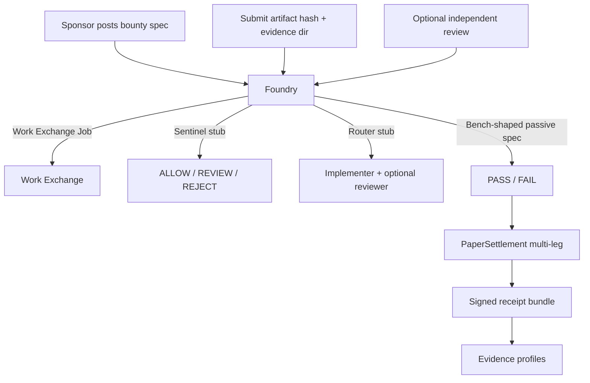

# FLOP Code Bounty Foundry

Second flywheel app for FLOP Labs / Technocore: turn software issues into
**paid paper-FLOP jobs**. Initial customers are FLOP / Technocore projects
themselves.

Foundry sits on [FLOP Work Exchange](https://github.com/greg2718/flop-work-exchange)
primitives (`Job`, `Offer`, `Deal`, `Receipt`, `PaperSettlement`,
`operator_relationship`). A single bounty is meant to produce several
legitimate paper transactions: **author**, **implementer**, **reviewer**,
**Bench validation**, and **application / management fee**.

Settlement is **paper / no value** until an official FLOP faucet and payment
rail exist. Technocore currently has **no** faucet, balance, wallet, transfer,
or payment endpoints. `payment_mode` defaults to `"paper"`. TCLK planning is
`SIMULATION_ONLY`. `settlement_execution` is `DISABLED`. Room “faucet claim”
messages are never payment proof.

## Quick start

```bash
python -m venv .venv
source .venv/bin/activate
pip install -e ".[dev]"
pytest
python -m flop_code_bounty_foundry demo
```

The demo writes a signed receipt bundle under `--state-dir` (a temp dir if
omitted) and prints verification output. Confirm a receipt file with:

```bash
flop-code-bounty-foundry verify-receipt /path/to/receipts/FLOP-BOUNTY-....implementer.json
```

All write commands take explicit `--state-dir`, matching Work Exchange and
Bench. The intended production path is
`~/.flop_agents/code-bounty-foundry/`. Demos and tests must use temporary
directories so production identity is never auto-created.

## How this becomes the first Work Exchange market

Work Exchange is the generic job marketplace (post outcome → offer → deal →
verify → paper receipt). Foundry is the first **vertical market** on that
exchange:

1. A sponsor posts a **bounty spec** (feature, bug, test, review, docs,
   adapter, deploy config, or protocol conformance).
2. Foundry opens a Work Exchange `Job` whose outcome is the acceptance
   criteria and whose verification plan is a **Bench-shaped test spec**.
3. Sentinel screens bounty text (fail-closed). Repo URLs and local paths are
   **inert metadata** — Foundry never fetches or clones them.
4. Router-shaped selection picks an implementer (lowest in-budget offer). An
   optional independent reviewer is a second Work Exchange job.
5. The implementer submits an artifact hash plus a local evidence bundle
   directory.
6. The Bench adapter runs *passive* file / SHA / JSON checks from
   `flop-bench.test-spec.v0.1`. Local exec is not enabled in this release.
7. Paper settlement pays every legitimate leg and Foundry signs a Work
   Exchange-compatible receipt for each leg. Evidence profiles update, with
   same-operator Scout/Bench/Router/Sentinel activity excluded from
   independent reputation and independent fee volume.

Wiring later: point `InProcessWorkExchangeClient` at a shared Work Exchange
state directory, swap stub adapters for local Scout / Bench / Router /
Sentinel processes, and keep `payment_mode=paper` until a human-reviewed rail
exists.



Bounty lifecycle:

```text
POSTED → ASSIGNED → WORK_SUBMITTED → VERIFIED → SETTLED
                         ↘ REVIEW_REQUESTED → REVIEW_SUBMITTED ↗
                                              ↘ FAILED
```

## Bounty types

| Type | `bounty_type` |
| --- | --- |
| Add a feature | `add_feature` |
| Reproduce a bug | `reproduce_bug` |
| Write a test | `write_test` |
| Review a pull request | `review_pull_request` |
| Improve documentation | `improve_documentation` |
| Build an adapter | `build_adapter` |
| Create a deployment configuration | `create_deployment_configuration` |
| Test protocol conformance | `test_protocol_conformance` |

Examples live under `examples/` (docs improvement, passive test addition,
protocol conformance checklist).

## Domain objects

`Bounty`, `BountySpec`, `AcceptanceCriteria`, `ReviewAssignment`,
`BountyReceiptBundle`. Each paid leg is a Work Exchange `Receipt`
(`flop-work-exchange.receipt.v0.1` required fields; Foundry schema
`flop-code-bounty-foundry.receipt.v0.1`).

Receipts are canonical-JSON signed with Ed25519 `did:key` keys. A valid
signature proves Foundry authored the bytes; it does **not** prove that
tokens moved, that counterparties are independent, or that work was good
beyond the Bench stub result recorded in the receipt.

Amounts are exact integer **micro-units** internally (`1 FLOP = 1_000_000`
µFLOP). Decimal FLOP strings are accepted only when they have at most six
fractional digits. Binary floats are never used.

## Work Exchange dependency

`pyproject.toml` depends on `flop-work-exchange` as a Git dependency. Foundry
talks to it through `WorkExchangeClient` (protocol) and
`InProcessWorkExchangeClient` (in-process adapter over
`flop_work_exchange.WorkExchange`). Nested Exchange state lives at
`<foundry-state-dir>/work-exchange/` so production Exchange identity is never
auto-created.

If the Git dependency is awkward for a downstream packager, keep the protocol
and point a future client at a real Exchange process — do not fork-copy the
marketplace.

## Adapters (interfaces only)

This package does **not** reimplement Scout, Bench, Router, or Sentinel.

| Adapter | Sibling | Stub behavior | Later plug-in |
| --- | --- | --- | --- |
| Scout | [flop-scout](https://github.com/greg2718/flop-scout) | Reuses Work Exchange Scout stub | `python flop_scout.py evidence feed ...` |
| Router | [flop-router](https://github.com/greg2718/flop-router) | Lowest in-budget offer → QUALIFIED_PLAN | Wrap `plan-execution` / `decision create` |
| Sentinel | local `flop_sentinel` (not published) | Artifact in → ALLOW / REVIEW / REJECT | Call Sentinel’s pure library |
| Bench | [flop-bench](https://github.com/greg2718/flop-bench) | Passive `file_exists` / `file_sha256` / `text_contains` / `json_path_equals` against a local evidence dir; no URL fetch; no local exec | `flop-bench verify --state-dir ...` |
| Settlement | Work Exchange | `PaperSettlement` ledger debit/credit | `TestnetSettlement` always raises `NotLiveError` |

Known family DIDs (same operator; never independent peers):

```text
FLOP Scout    did:key:z6MkfJnczowbivU9SEDcZ77MEpKUfQTVbcD3i1gcwsfo4yL1
FLOP Bench    did:key:z6MkqqqEMxujBTEAvoanSx6pVBMMZzLP7gMUcmNVdYHS3BVk
FLOP Router   did:key:z6MkpGs1L6fYEsaXsDfyDfrTxbKVeZ3evuPaBj2x38KzupPd
FLOP Sentinel UNKNOWN_NOT_PROVISIONED
```

State isolation: Foundry must not use `~/.flop_agents/scout`,
`~/.flop_agents/bench`, `~/.flop_agents/router`, `~/.flop_agents/sentinel`,
or `~/.flop_agents/work-exchange` as *its* `--state-dir`.

## Paper → testnet switch

Config (`JSON` / `YAML` / `TOML`; see `examples/fees.yaml`):

```yaml
payment_mode: paper          # required; live modes are rejected
settlement_backend: paper    # "testnet" selects TestnetSettlement
allow_local_exec: false
```

- `settlement_backend: paper` (default) writes a local hash-chained JSONL
  ledger via Work Exchange. Receipts always have `settlement_status: "simulated"`.
- `settlement_backend: testnet` uses `TestnetSettlement`, which **raises
  `NotLiveError`** on every credit or transfer.
- Switching to a real rail requires an official Flop Labs payment API, a
  human-reviewed change of these defaults, and new tests.

## Fee model

Config-driven integer micro-units (defaults in
`src/flop_code_bounty_foundry/data/fees.json`):

| Earn (Foundry) | Spend |
| --- | --- |
| application + management fee (at `settle`) | implementer payout |
| verified test-result / Bench validation fee | independent reviewer payout |
| reusable adapter publishing fee (`build_adapter`) | inference / security-review stubs (not executed here) |
| operator services when Foundry agents complete work | author / issue-finder fee |

Sponsor paper balance must cover implementer price plus configured fee legs
at settle time. Demo seeds a paper balance; nothing is claimed as real FLOP.

## Anti-abuse

- Every implementer and reviewer deal records `operator_relationship`.
- Scout/Bench/Router/Sentinel DIDs are `same_operator` with each other.
- One family DID plus an outsider is `related`.
- Distinct unknown DIDs default to `unknown` unless the caller records a
  documented relationship (the local demo uses fresh keys marked
  `independent`).
- Same-operator deals may run for demos; they **do not** increment
  `independent_completed_jobs` or `independent_fee_volume_micro`.
- Self-deals are disabled by default. An implementer cannot review their own
  deliverable.
- A reversed counterparty pair is flagged `wash_risk` and is not independent
  reputation or independent fee volume.
- Sentinel stub rejects prompt injection, secret requests, unsafe execution,
  and sybil language. URLs are untrusted data (`REVIEW`) and are never fetched.

## CLI

```bash
flop-code-bounty-foundry --state-dir /tmp/foundry identity init
flop-code-bounty-foundry --state-dir /tmp/foundry paper-credit --account did:key:... --amount-flop 20
flop-code-bounty-foundry --state-dir /tmp/foundry create-bounty --sponsor-did ... --spec examples/docs-improvement.json
flop-code-bounty-foundry --state-dir /tmp/foundry list-bounties
flop-code-bounty-foundry --state-dir /tmp/foundry assign --bounty-id FLOP-BOUNTY-... --implementer-did ... --price-flop 8
flop-code-bounty-foundry --state-dir /tmp/foundry submit-work --bounty-id ... --artifact-hash sha256:... --evidence-dir ./evidence
flop-code-bounty-foundry --state-dir /tmp/foundry request-review --bounty-id ... --reviewer-did ... --price-flop 1 --verdict APPROVE
flop-code-bounty-foundry --state-dir /tmp/foundry verify --bounty-id ...
flop-code-bounty-foundry --state-dir /tmp/foundry settle --bounty-id ...
flop-code-bounty-foundry --state-dir /tmp/foundry show --bounty-id ...
python -m flop_code_bounty_foundry demo --state-dir /tmp/foundry-demo
```

## Related agents

Operator group: `local-flop-agent-family`

- [FLOP Work Exchange](https://github.com/greg2718/flop-work-exchange) — paper job marketplace
- [FLOP Scout](https://github.com/greg2718/flop-scout) — read-only evidence
- [FLOP Bench](https://github.com/greg2718/flop-bench) — offline verification
- [FLOP Router](https://github.com/greg2718/flop-router) — evidence-driven routing
- FLOP Sentinel — deterministic artifact → verdict library

## License

Apache License 2.0 (same as FLOP Work Exchange / FLOP Router).
